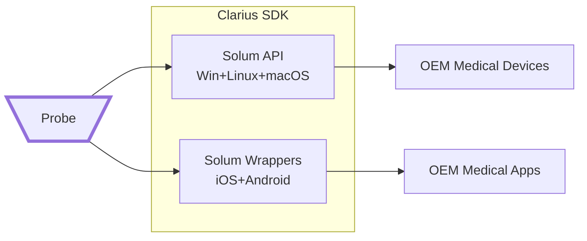

Partners
========

Clarius is excited to be working with multiple partners that are bringing new technologies into the healthcare space that require ultrasound imaging for real-time guidance and other novel clinical solutions.

Working with Clarius scanners is extremely simple, and leveraging our suite of APIs through our **Clarius SDK** program allows partners to build elegant solutions that work directly with Clarius' existing ecosystem, or to build an entirely standalone solution.

OEM Partnerships
================

Those wishing to develop completely standalone solutions can work with Clarius and enter into an OEM partnership that will allow a 3rd party to purchase and deploy Clarius scanners on their own technology platform to their own customers. Some eligibility requirements for becoming an OEM partner include:
* Minimum yearly purchase of scanners
* Paying a nominal yearly fee per scanner (the oem license)
* Paying a yearly support fee for training, support, and any custom development required

From the technology standpoint, partners can develop and deploy in any means they wish, however we have built the dedicated [Solum API](https://github.com/clariusdev/solum) for creating standalone software and Apps. Developers are encouraged to build a full ecosystems for their customers with potential to use cloud, implement custom analysis and reporting, and build in proper security measures.

Solum is available for deployment on the following platforms:
 * Windows
 * Linux
 * iOS
 * Android

Cloud Integrations
==================

For partners requiring cloud-based AI or workflow solutions, that do not typically require real-time imaging or analysis, Clarius has built a [framework](https://github.com/clariusdev/cloud) within our Cloud to be able to push completed exams into another platform. Services taking advantage of this technology could make use of:
* Clinical review services
* Cloud based AI and reporting
* EMR integrations

Architecture
============
                              

                              
     
